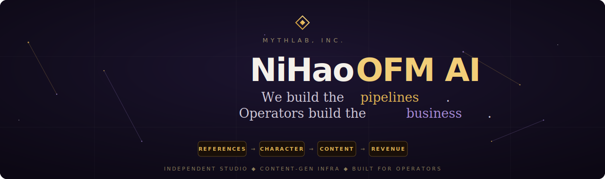

  

## ◆ What I'm building

- [Mythlab, Inc.](https://mythlab.art) — > Head of Products @ Mythlab — I orchestrate what gets built & shipped.
- [SinLab](https://sinlab.art) — AI content generation platform for creators & agencies
- [PureLab](https://purelab.art) — the SFW side

## ◆ Stack

Backend — Python · FastAPI · PostgreSQL · Redis · Celery · Docker 
Frontend — React · TypeScript · Vite · Tailwind · shadcn/ui 
AI / GPU — ComfyUI · LoRA training · Vast.ai · Cloudflare R2 
Observability — PostHog · Grafana · Sentry · Prometheus

## ◆ How I build

Orchestrating fleets of AI coding agents across a large codebase. 
Prompts that teach how to think, not what to write.

## ◆ Off the clock

FPV freestyle · motorcycles · Phuket
